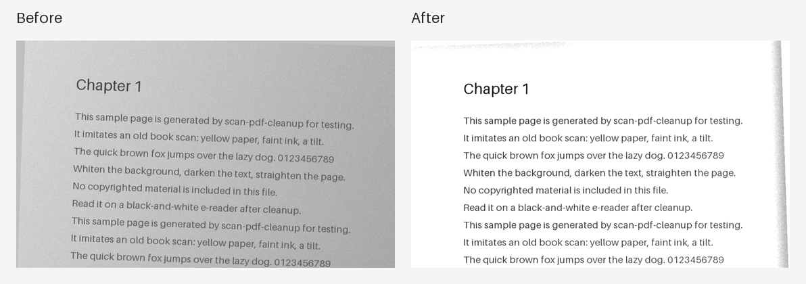

# 책갈피 툴 – 스캔 PDF 보정

[English](README.en.md) · [中文](README.zh-CN.md) · [日本語](README.ja.md)

누렇고 흐린 스캔 PDF를 배경은 희게, 글씨는 진하게 바꿔 이북리더기 흑백 화면에서 읽히게 만듭니다. 서버 없음, 설치 없음, 원본 무수정.



## 다운로드

- **실행 파일**: [Releases](https://github.com/microhan1/scan-pdf-cleanup/releases)에서 `scan-pdf-cleanup.exe`를 받아 더블클릭. 설치 없이 바로 실행됩니다.
- **소스 실행**:

```bash
pip install -r requirements.txt
python main.py
```

## 사용법

1. PDF 파일이나 폴더를 창에 끌어다 놓습니다.
2. 미리보기를 보며 옵션을 조정합니다 (배경 희게 · 글씨 진하게 · 색 모드 · 기울기 보정 · 해상도).
3. **실행**을 누르면 원본 옆에 `<원본명>_clean.pdf`가 만들어집니다.

명령줄로도 쓸 수 있습니다.

```bash
python main.py input.pdf --contrast mid --mode gray --dpi 200 --deskew
```

`python main.py --help`가 OS 언어(한국어 · English · 中文 · 日本語)로 옵션을 보여줍니다.

## 하지 않는 것

- OCR은 하지 않습니다. 결과는 이미지 PDF입니다.
- 여백 자르기, 두쪽 나누기는 별도 툴입니다. 이 툴은 화질만 다룹니다.
- 컬러 사진 위주 잡지 스캔은 대상이 아닙니다.

## 시리즈

- 책갈피 툴: [여백 자르기](https://github.com/microhan1/scan-pdf-crop) · [두쪽 나누기](https://github.com/microhan1/scan-pdf-split)
- [책갈피 라이브러리](https://github.com/microhan1/chaekgalpi)

## 라이선스

MIT. [LICENSE](LICENSE) 참조.
